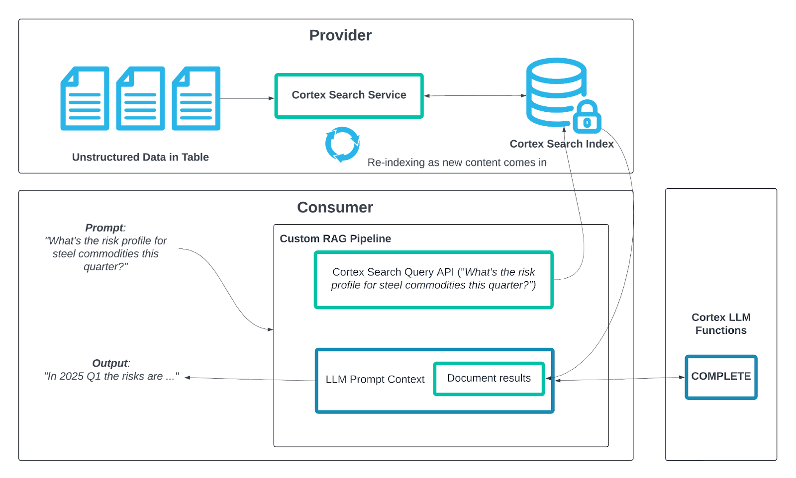
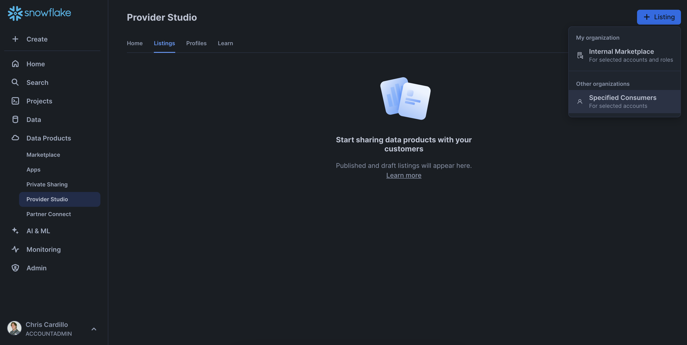
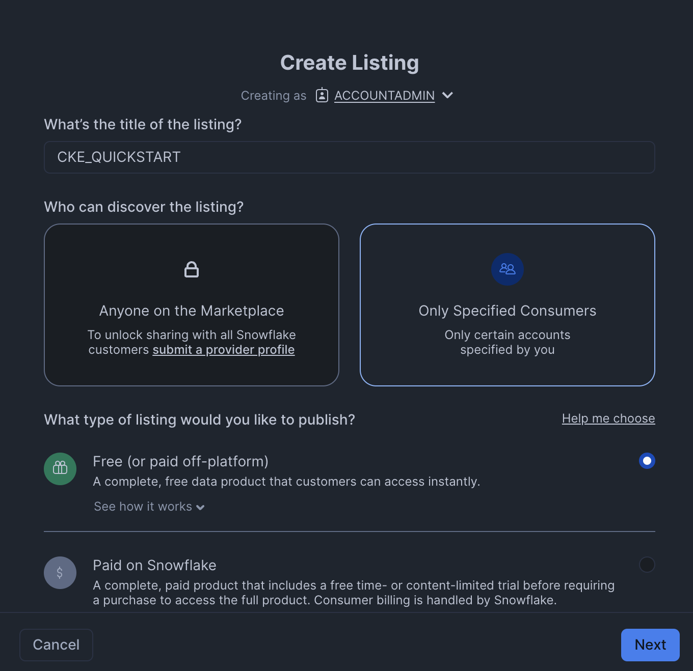
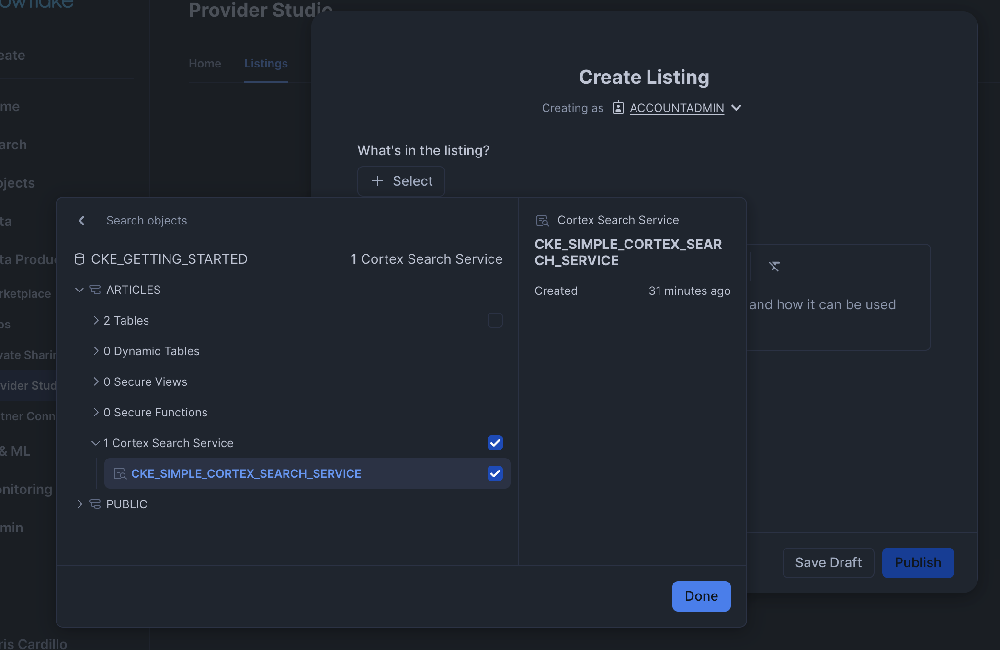
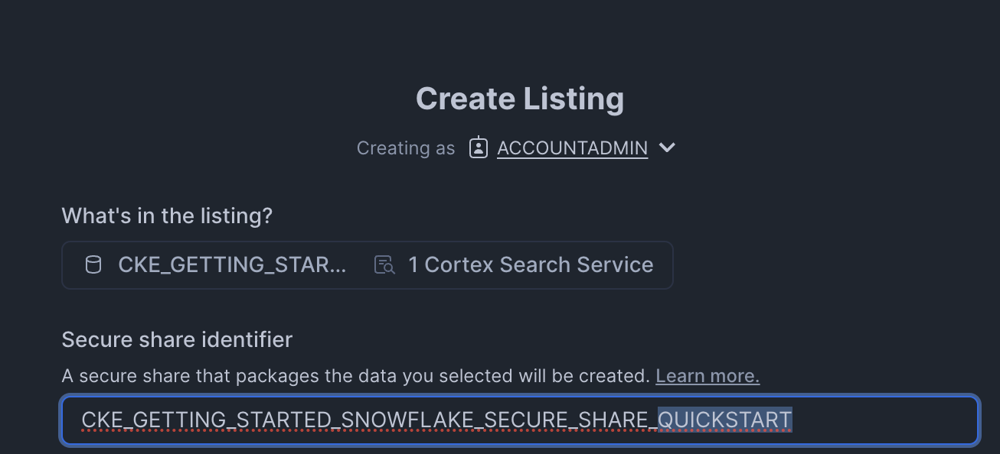
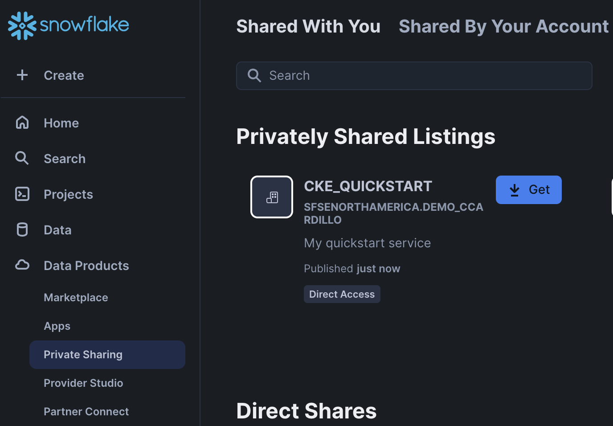

author: sfc-gh-ccardillo
id: getting-started-with-cortex-knowledge-extensions
summary: This is a sample Snowflake Guide
categories: Getting-Started
environments: web
status: Published 
feedback link: https://github.com/Snowflake-Labs/sfguides/issues
tags: Getting Started, Data Science, Data Engineering, Twitter 

# Getting Started with Cortex Knowledge Extensions
<!-- ------------------------ -->
## Overview
Duration: 5

Cortex Knowledge Extensions (CKEs) allow publishers to bring their documents (e.g. news articles, market research reports, books, articles, etc.) to customers in their generative AI applications (e.g. chat interfaces, agentic platforms, etc.).

CKEs are shared Cortex Search Services on the Snowflake Marketplace that integrate with Cortex generative AI applications following the [retrieval augmented generation (RAG) pattern](https://quickstarts.snowflake.com/guide/ask_questions_to_your_own_documents_with_snowflake_cortex_search/index.html#0). 

Here is how it works:

- A **Provider** uploads their text documents into a Table in the Provider account and indexes that data with a Cortex Search Service. This Cortex Search Service is then shared onto the Snowflake Marketplace and is known as a Cortex Knowledge Extension (CKE). 
- A **Consumer** builds a generative AI application such as a chatbot using Cortex LLM functions or the Cortex Agent API with the Cortex Knowledge Extension, which all work together leveraging retrieval augmented generation (RAG). 



### Prerequisites

- Some familiarity with [LLMs and Retrieval Augmented Generation](https://www.snowflake.com/en/blog/easy-secure-llm-inference-retrieval-augmented-generation-rag-cortex/) (RAG).

### What You’ll Learn 

- How to create a Cortex Search Service
- How to share your Cortex Search Service as a Cortex Knowledge Extension on the Snowflake Marketplace

### What You’ll Need 

- A [Snowflake](https://app.snowflake.com/) account
- `ACCOUNTADMIN` privileges on the Snowflake account you are using
- (Optional but helpful) a second Snowflake account in your Snowflake organization, with which to share you listing

### What You’ll Build 

- A Cortex Search Service
- A Cortex Knowledge Extension, via a private listing for the shared Cortex Search Service

<!-- ------------------------ -->
## Roles, Permissions, and Objects
Duration: 5

First we will create a role, `cke_owner` for this quickstart, and create a database and compute warehouse that will be used throughout.

Please note you will need to grant the role `cke_owner` to the user you are using for the tutorial.

Open up a Snowflake console or your favorite IDE and run the commands below.

```sql
USE ROLE ACCOUNTADMIN;

-- Role and permissions
CREATE ROLE cke_owner;
GRANT CREATE WAREHOUSE ON ACCOUNT TO ROLE cke_owner;
GRANT CREATE DATABASE ON ACCOUNT TO ROLE cke_owner;

-- Replace <your-username> with your Snowflake username
GRANT ROLE cke_owner TO USER <your-username>;

-- Use Role
USE ROLE cke_owner;

-- Create Objects
CREATE DATABASE cke_getting_started;
CREATE WAREHOUSE cke_getting_started WAREHOUSE_SIZE=xsmall;

-- Use objects
USE DATABASE cke_getting_started;
USE WAREHOUSE cke_getting_started;
```

<!-- ------------------------ -->
## Data Loading
Duration: 5

There are [many ways to load data into Snowflake](https://docs.snowflake.com/en/guides-overview-loading-data). For this tutorial, we will simply create a table with the text from our documents. 

Our table will have the following columns:

<table>
  <tr>
    <th>Column Name</th>
    <th>Type</th>
    <th>Description</th>
  </tr>
  <tr>
    <td>DOCUMENT_ID</td>
    <td>VARCHAR</td>
    <td>A unique integer identifier for the document</td>
  </tr>
  <tr>
    <td>DOCUMENT_TITLE</td>
    <td>VARCHAR</td>
    <td>The title of the document</td>
  </tr>
  <tr>
    <td>SOURCE_URL</td>
    <td>VARCHAR</td>
    <td>A URL linking to the source of the document</td>
  </tr>
  <tr>
    <td>TEXT</td>
    <td>VARCHAR</td>
    <td>The document contents, parsed as text</td>
  </tr>
</table>

Let's create a schema, `articles`, for our documents table.

```sql
CREATE SCHEMA cke_getting_started.articles;
```

Now, let's create our table.

```sql
CREATE TABLE cke_getting_started.articles.cke_simple_article (
    DOCUMENT_ID VARCHAR, 
    DOCUMENT_TITLE VARCHAR,
    SOURCE_URL VARCHAR,
    text VARCHAR
);
```

Finally, let's insert some values into our `cke_simple_article` table.

```sql
INSERT INTO cke_getting_started.articles.cke_simple_article (DOCUMENT_ID, DOCUMENT_TITLE, SOURCE_URL, TEXT)
VALUES
    ('DOC_001', 
     'Sample Article 1',
     'https://example.com/article1',
     'This is some sample text for the first article.'),
    ('DOC_002',
     'Sample Article 2',
     'https://example.com/article2',
     'Another sample text entry for the second article.'),
    ('DOC_003',
     'Sample Article 3',
     'https://example.com/article3',
     'Yet another piece of text for the third article.'),
    ('DOC-GREEN-001',
    'The Grand Opening of Greenfield Biosphere',
    'https://www.example.com/news/greenfield-biosphere',
    'Greenfield Biosphere, nestled in the heart of a once-industrial landscape, opened its doors to the public today amid great fanfare and curiosity. This ambitious environmental initiative, spanning over 120 acres of reclaimed land, has been designed to house thousands of diverse plant species and animals under one vast, transparent dome. Over the past decade, teams of botanists, engineers, and conservationists collaborated intensively to restore the soil quality, implement renewable energy solutions, and establish sustainable water sources. Their efforts have resulted in an oasis that stands as a testament to nature''s resilience and humanity''s unwavering determination to coexist with it.');
```

We can confirm the rows have been inserted into our table with the following command.

```sql
SELECT * FROM cke_getting_started.articles.cke_simple_article;
```

<!-- ------------------------ -->
## Document Chunks
Duration: 5

Prior to creation of a Cortex Search Service, we need to ensure that each “chunk” of indexed text is no more than ~375 words of text. To do so, we can apply a chunking algorithm with a Snowpark User-Defined Function (UDF) that imports and utilizes the Python package LangChain.

First, let's create a UDF will turn the text from our previously created `cke_simple_article` into chunks, or rows where there's no more than 375 words of text per row. We'll call our UDF `text_chunker`.

```sql
CREATE FUNCTION cke_getting_started.articles.text_chunker(text STRING)
    RETURNS TABLE (chunk VARCHAR)
    LANGUAGE PYTHON
    RUNTIME_VERSION = '3.9'
    HANDLER = 'text_chunker'
    PACKAGES = ('snowflake-snowpark-python', 'langchain')
    AS
$$
from snowflake.snowpark.types import StringType, StructField, StructType
from langchain.text_splitter import RecursiveCharacterTextSplitter
from snowflake.snowpark.files import SnowflakeFile
import logging
import pandas as pd

class text_chunker:

    def process(self, text: str):
        text_splitter = RecursiveCharacterTextSplitter(
            chunk_size = 2000,  # Adjust this as needed
            chunk_overlap = 300,  # Overlap to keep chunks contextual
            length_function = len
        )

        chunks = text_splitter.split_text(text)
        df = pd.DataFrame(chunks, columns=['chunk'])

        yield from df.itertuples(index=False, name=None)
$$;
```

Next, we'll use the `text_chunker` UDF to turn our previously created `cke_simple_article` into chunks. We'll store these chunks in a separate table, `cke_simple_article_chunks`.

```sql
CREATE TABLE cke_getting_started.articles.cke_simple_article_chunks AS
    SELECT
        c.DOCUMENT_ID,
        c.DOCUMENT_TITLE,
        c.SOURCE_URL,
        t.chunk
    FROM cke_getting_started.articles.cke_simple_article AS c, TABLE(cke_getting_started.articles.text_chunker(CONCAT(c.DOCUMENT_TITLE, '\n', c.TEXT))) AS t;
```

Finally, we'll verify the table was created.

```sql
SELECT * FROM cke_getting_started.articles.cke_simple_article_chunks;
```

<!-- ------------------------ -->
## Cortex Search Service
Duration: 5

We now have all of the pieces in place to create our Cortex Search Service.

Run the command below to create a Cortex Search Service called `cke_simple_cortex_search_service` that will utilize the `cke_simple_article_chunks` table as a search index and the `cke_getting_started` warehouse to ensure that any chunks in the `cke_simple_article_chunks` table are indexed in the search service with a lag of no more than 1 hour.

```sql
CREATE OR REPLACE CORTEX SEARCH SERVICE cke_getting_started.articles.cke_simple_cortex_search_service
    ON CHUNK
    ATTRIBUTES document_title
    WAREHOUSE = cke_getting_started
    TARGET_LAG = '1 hour'
    AS (
        SELECT
            chunk,
            document_title,
            source_url
        FROM cke_getting_started.articles.cke_simple_article_chunks
    );
```

### Verify Search Queries

Finally, let's query our Cortex Search Service.

```sql
SELECT snowflake.cortex.search_preview(
    'cke_getting_started.articles.cke_simple_cortex_search_service',
    '{ "query": "whats happening with the greenfield biosphere?", "columns": ["chunk", "document_title", "source_url"], "limit": 1 }'
) AS results;
```

<!-- ------------------------ -->
## Private Listing
Duration: 10

We'll now use the Snowsight UI to create a [private listing](https://other-docs.snowflake.com/en/collaboration/provider-listings-creating-publishing#share-data-or-apps-with-specific-consumers-using-a-private-listing) for our previously created Cortex Search Service, thus creating our Cortex Knowledge Extension (CKE). We'll use the `ACCOUNTADMIN` role for this.

First, we'll navigate to the [Provider Studio](https://app.snowflake.com/#/provider-studio) section of our account. And click the `+ Listing` button. 



If you have an additional account in which you'd like to share your listing , click Specified Consumers, as shown above. Otherwise, select Internal Marketplace.

Next, give a title, such as `CKE_QUICKSTART`, to your listing and hit `Next`.



Next, add your Cortex Search Service to the listing by hitting `+ Select` and navigating to your search service, through the database object `CKE_GETTING_STARTED`, the `ARTICLES` schema, and finally the Corext Search Service `CKE_SIMPLE_CORTEX_SEARCH_SERVICE`.



Note that once you select the service, you are shown a Secure Share Identifier. It is suffixed with a random string of numbers. For consistency, let's replace that string of numbers with the word "quickstart", so our Secure Share Identifier name will be `CKE_GETTING_STARTED_SNOWFLAKE_SECURE_SHARE_QUICKSTART`.



Finally, if you chose Specified Consumers when creating the listing, choose an account with which to share you listing. The account locator you insert follows the format `orgName-accountName`. It is possible to share your listing with accounts that exist within your organization, just to test. Learn more about using the `ORGADMIN` role to create additional accounts [here](https://docs.snowflake.com/en/user-guide/organizations-manage-accounts-create). If you are sharing your listing with accounts in other regions or clouds, ensure you set up [Cross-Cloud Auto-Fulfillment](https://other-docs.snowflake.com/en/collaboration/provider-listings-auto-fulfillment).

<!-- ------------------------ -->
## Optional: Consuming the Cortex Knowledge Extension
Duration: 10

If you have shared your Cortex Knowledge Extension with another account, you can now go test out your CKE in that other account!

Simply navigate to Data Products >> Private Sharing,  find the listing, and click "Get".



Now open a new Snowflake worksheet and try out the CKE. It will be accessible using the title of the listing, plus the existing schema and Cortex Search Service name from the previous account.

```sql
SELECT 
    snowflake.cortex.search_preview(
        'CKE_QUICKSTART.ARTICLES.CKE_SIMPLE_CORTEX_SEARCH_SERVICE', 
        '{ "query": "whats happening with the greenfield biosphere?", "columns": ["chunk", "document_title", "source_url"], "limit": 1 }'
    ) AS result;
```

You should now see the results from the CKE in your consumer account!

At this point, the consumer can create additional downstream applications using the CKE, such as a [RAG app](https://quickstarts.snowflake.com/guide/ask_questions_to_your_own_documents_with_snowflake_cortex_search/index.html#0).

<!-- ------------------------ -->
## Conclusion And Resources
Duration: 5

Congratulations - you made a Cortex Knowledge Extension! CKEs are great tools for knowledge providers, such as publishers and news outlets, to make their knowlegdge usable by consumers directly through Snwoflake.

### What You Learned
- How to create a Cortex Search Service
- How to share your Cortex Search Service as a Cortex Knowledge Extension on the Snowflake Marketplace

### Related Resources
- [Cortex Search overview](https://docs.snowflake.com/en/user-guide/snowflake-cortex/cortex-search/cortex-search-overview)
- [Creating a RAG app using Cortex Search and Cortex Complete](https://quickstarts.snowflake.com/guide/ask_questions_to_your_own_documents_with_snowflake_cortex_search/index.html#0)
- [Becoming a listing provider](https://other-docs.snowflake.com/en/collaboration/provider-becoming)
- [Creating and publishing listings](https://other-docs.snowflake.com/en/collaboration/provider-listings-creating-publishing)

<!-- ------------------------ -->
## Cleanup
Duration: 5

If you have shared with a "consumer" account in your organization, drop the database `CKE_QUICKSTART`.

```sql
DROP DATABASE CKE_QUICKSTART;
```

Next, in the provider account, where you created the service and listing, navigate to Data Products >> Provider Studio >> Listings and find the `CKE_QUICKSTART` listing. Ensure you are using the `ACCOUNTADMIN` role. Click the "Live" button, then select "Unpublish" in the upper right-hand corner, and then the trash can that appears after unpublishing. Follow the prompts to delete the listing.

Finally, drop the database, warehouse and `CKE_OWNER` role.

```sql
USE ROLE ACCOUNTADMIN;
DROP SHARE CKE_GETTING_STARTED_SNOWFLAKE_SECURE_SHARE_QUICKSTART;

USE ROLE CKE_OWNER;
DROP DATABASE cke_getting_started;
DROP WAREHOUSE cke_getting_started;

USE ROLE ACCOUNTADMIN;
DROP ROLE CKE_OWNER;
```